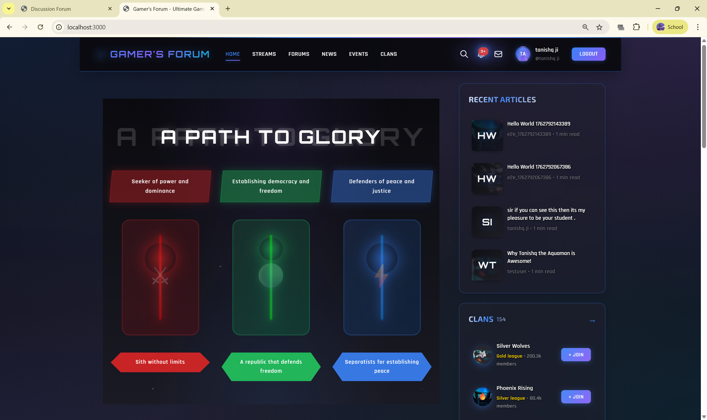
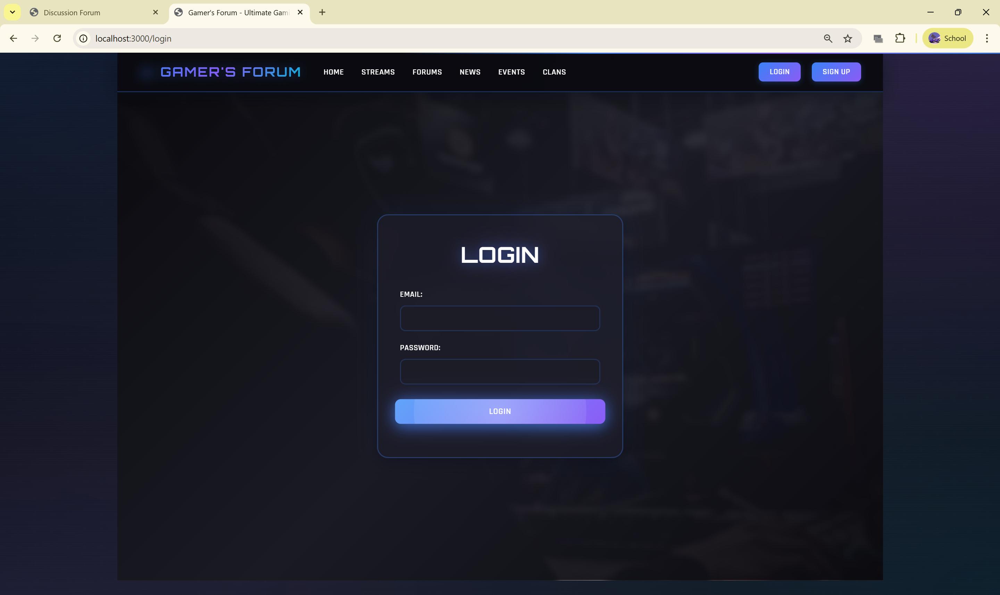
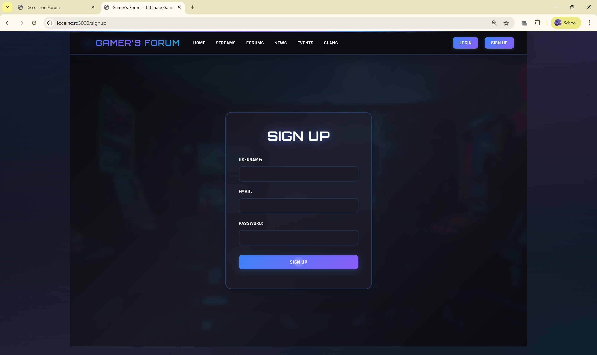
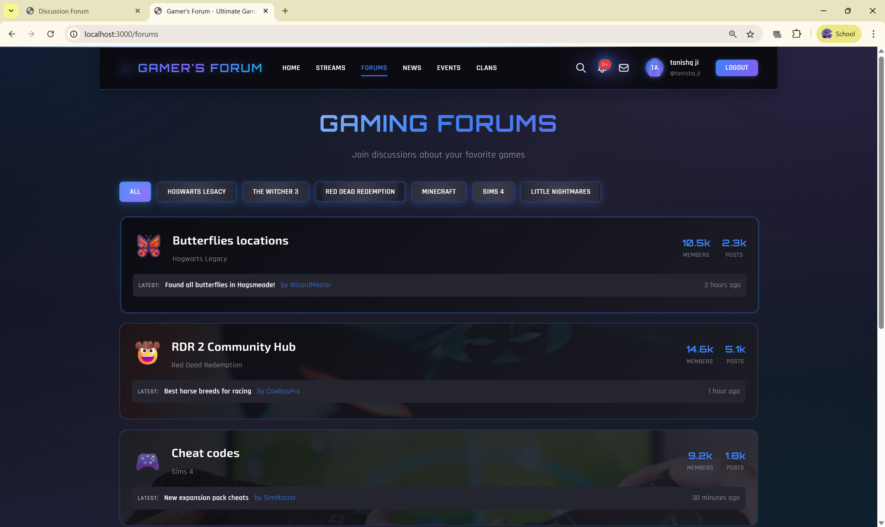
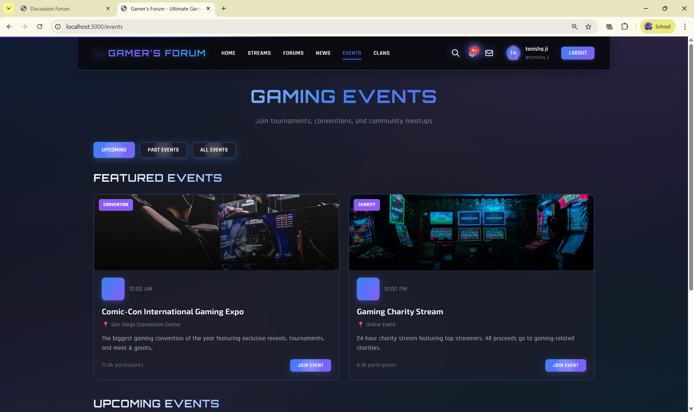
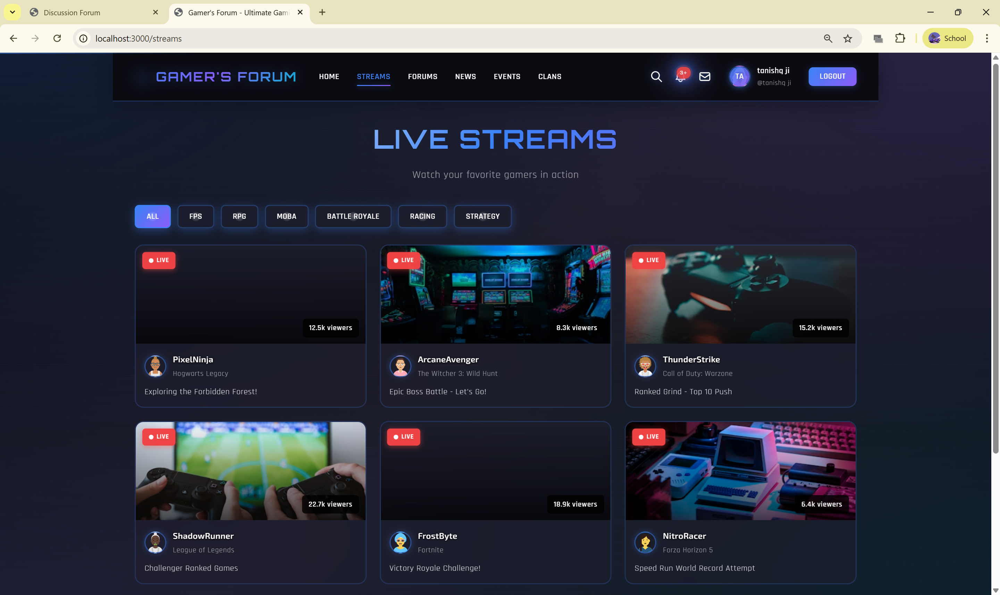
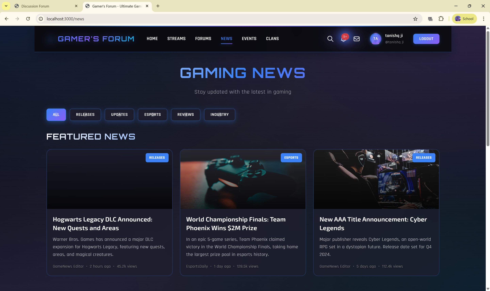
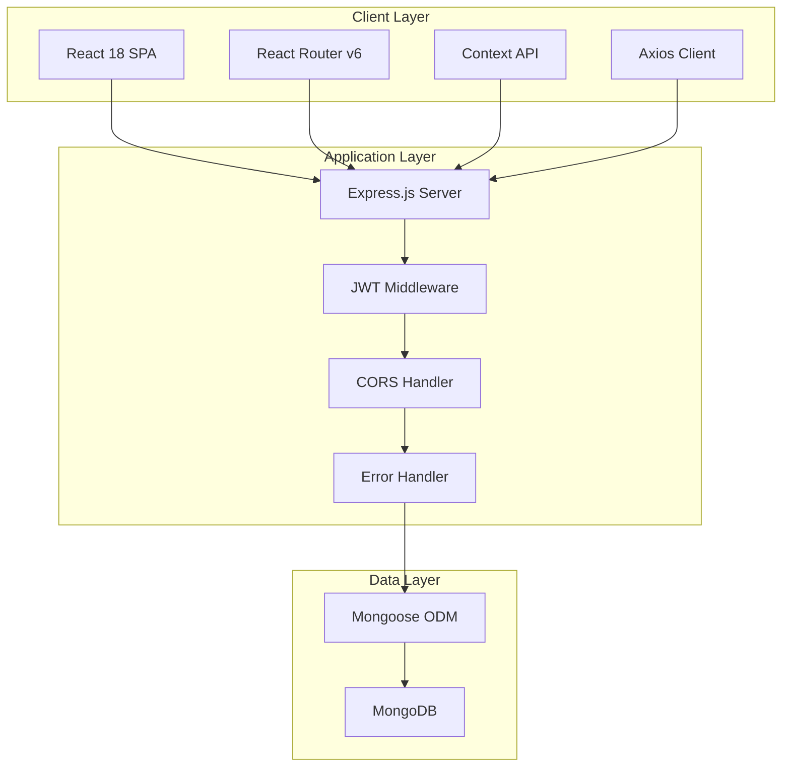

<div align="center">

# 🎮 Gamer's Forum

### *Enterprise Gaming Community Platform*

[](https://opensource.org/licenses/MIT)
[](https://nodejs.org/)
[](https://www.mongodb.com/)
[](https://expressjs.com/)
[](https://reactjs.org/)
[](https://vitejs.dev/)

**A production-grade, full-stack gaming community platform built with the MERN stack**

[Features](#-key-features) • [Screenshots](#-application-showcase) • [Installation](#-quick-start) • [Documentation](#-documentation) • [API](#-api-reference)

---



</div>

---

## 📖 Overview

**Gamer's Forum** is an enterprise-level gaming community platform that brings gamers together through engaging discussions, competitive clans, live events, and real-time streaming. Built with modern web technologies and best practices, it demonstrates production-ready architecture, security, and scalability.

<div align="center">

### 🎯 **Built For**

Competitive Gamers • Content Creators • Gaming Communities • Esports Teams

</div>

---

## ✨ Key Features

<table>
<tr>
<td width="50%">

### 🔐 **Secure Authentication**
- JWT-based stateless authentication
- bcrypt password hashing (10 rounds)
- Protected routes & API endpoints
- Session persistence

### 💬 **Discussion Forums**
- Game-specific discussion boards
- Threaded comments system
- Real-time post updates
- Rich text content support

### ⚔️ **Gaming Clans**
- Tier-based rankings (Gold/Silver/Bronze/Platinum)
- Member statistics & leaderboards
- Clan discovery & search
- Game-specific associations

</td>
<td width="50%">

### 🎪 **Events & Tournaments**
- Gaming conventions
- Online tournaments
- Charity streams
- RSVP & registration system

### 📺 **Live Streaming Hub**
- Stream discovery & browsing
- Real-time viewer counts
- Streamer profiles
- Game category filters

### 📰 **News & Content**
- Gaming news & updates
- Game reviews & guides
- Article management
- Category-based filtering

</td>
</tr>
</table>

---

## 🎨 Application Showcase

<div align="center">

### Authentication System

<table>
<tr>
<td width="50%">

**🔑 Login**



*Secure JWT authentication with elegant UI*

</td>
<td width="50%">

**✍️ Sign Up**



*User registration with validation*

</td>
</tr>
</table>

---

### Main Features

**🏠 Home Dashboard**


*Immersive Star Wars-themed dashboard with path selection, popular forums, and discussion feed*

---

<table>
<tr>
<td width="33%">

**💬 Forums**



*Game-specific boards*

</td>
<td width="33%">

**⚔️ Clans**


*Competitive gaming clans*

</td>
<td width="33%">

**🎪 Events**



*Tournaments & conventions*

</td>
</tr>
<tr>
<td width="33%">

**📺 Streams**



*Live gaming streams*

</td>
<td width="33%">

**📰 News**



*Gaming news & reviews*

</td>
<td width="33%">

**🎯 More Features**

Coming soon...

*Future enhancements*

</td>
</tr>
</table>

</div>

---

## 🏗️ Architecture

<div align="center">



### Three-Tier Architecture Pattern

</div>

```
┌─────────────────────────────────────────┐
│     PRESENTATION LAYER (Tier 1)         │
│  • React 18 with Hooks                  │
│  • React Router v6                      │
│  • Context API State Management         │
│  • Axios HTTP Client                    │
└─────────────────────────────────────────┘
              ↕ REST API
┌─────────────────────────────────────────┐
│     APPLICATION LAYER (Tier 2)          │
│  • Express.js Server                    │
│  • JWT Authentication                   │
│  • MVC Architecture                     │
│  • Error Handling Middleware            │
└─────────────────────────────────────────┘
              ↕ Mongoose ODM
┌─────────────────────────────────────────┐
│        DATA LAYER (Tier 3)              │
│  • MongoDB Database                     │
│  • Schema Validation                    │
│  • Indexed Queries                      │
│  • Document Relationships               │
└─────────────────────────────────────────┘
```

---

## 💾 Data Model

<div align="center">

### Entity Relationship Diagram

</div>

```
┌──────────────────────────┐
│        Users             │
├──────────────────────────┤
│ 🔑 _id (PK)              │
│ 👤 username (unique)     │
│ 📧 email (unique)        │
│ 🔒 password (hashed)     │
│ 📅 createdAt             │
│ 📅 updatedAt             │
└──────────────────────────┘
           │
           │ 1:N
           ↓
┌──────────────────────────┐
│        Posts             │
├──────────────────────────┤
│ 🔑 _id (PK)              │
│ 📝 title                 │
│ 📄 content               │
│ 👤 author (FK)           │
│ 💬 comments[]            │
│ 📅 createdAt             │
│ 📅 updatedAt             │
└──────────────────────────┘
           │
           │ 1:N (embedded)
           ↓
┌──────────────────────────┐
│      Comments            │
├──────────────────────────┤
│ 🔑 _id                   │
│ 💬 content               │
│ 👤 author (FK)           │
│ 📅 createdAt             │
└──────────────────────────┘
```

---

## 🔒 Security

<div align="center">

### Security Implementation Checklist

</div>

| Security Feature | Implementation | Status |
|:-----------------|:---------------|:------:|
| **Password Hashing** | bcrypt (10 rounds) | ✅ |
| **JWT Authentication** | HS256, 30-day expiry | ✅ |
| **Route Protection** | Client & Server guards | ✅ |
| **CORS Configuration** | Whitelist origins | ✅ |
| **XSS Prevention** | React auto-escaping | ✅ |
| **NoSQL Injection** | Mongoose sanitization | ✅ |
| **Input Validation** | Schema validation | ✅ |
| **Rate Limiting** | express-rate-limit | 🔶 Recommended |
| **Helmet.js** | Security headers | 🔶 Recommended |
| **HTTPS/SSL** | TLS certificates | 🔶 Production |

<details>
<summary><b>🔐 View Authentication Flow</b></summary>

```
┌─────────┐          ┌──────────┐          ┌──────────┐
│ Client  │          │  Server  │          │ Database │
└────┬────┘          └────┬─────┘          └────┬─────┘
     │                    │                      │
     │  POST /signup      │                      │
     ├──────────────────> │                      │
     │                    │  Hash Password       │
     │                    │  (bcrypt)            │
     │                    │                      │
     │                    │  Save User           │
     │                    ├────────────────────> │
     │                    │ <────────────────────┤
     │                    │                      │
     │                    │  Generate JWT        │
     │                    │  (30d expiry)        │
     │                    │                      │
     │ <──────────────────┤                      │
     │  {token, user}     │                      │
     │                    │                      │
     │  GET /posts        │                      │
     │  Bearer <JWT>      │                      │
     ├──────────────────> │                      │
     │                    │  Verify Token        │
     │                    │  Decode Payload      │
     │                    │                      │
     │                    │  Fetch Data          │
     │                    ├────────────────────> │
     │                    │ <────────────────────┤
     │ <──────────────────┤                      │
     │  {posts}           │                      │
```

</details>

---

## 🛠️ Technology Stack

<div align="center">

### Frontend Technologies


### Backend Technologies


### Testing & Tools


</div>

<table>
<tr>
<th>Category</th>
<th>Technology</th>
<th>Version</th>
<th>Purpose</th>
</tr>
<tr>
<td rowspan="5"><b>Frontend</b></td>
<td>React</td>
<td>18.2.0</td>
<td>UI library with hooks</td>
</tr>
<tr>
<td>React Router DOM</td>
<td>6.15.0</td>
<td>Client-side routing</td>
</tr>
<tr>
<td>Axios</td>
<td>1.5.0</td>
<td>HTTP client</td>
</tr>
<tr>
<td>Vite</td>
<td>4.4.5</td>
<td>Build tool & dev server</td>
</tr>
<tr>
<td>Playwright</td>
<td>1.56.1</td>
<td>E2E testing</td>
</tr>
<tr>
<td rowspan="6"><b>Backend</b></td>
<td>Node.js</td>
<td>16+</td>
<td>JavaScript runtime</td>
</tr>
<tr>
<td>Express.js</td>
<td>4.18.2</td>
<td>Web framework</td>
</tr>
<tr>
<td>MongoDB</td>
<td>4.4+</td>
<td>NoSQL database</td>
</tr>
<tr>
<td>Mongoose</td>
<td>7.5.0</td>
<td>MongoDB ODM</td>
</tr>
<tr>
<td>jsonwebtoken</td>
<td>9.0.2</td>
<td>JWT tokens</td>
</tr>
<tr>
<td>bcryptjs</td>
<td>2.4.3</td>
<td>Password hashing</td>
</tr>
</table>

---

## 🚀 Quick Start

<div align="center">

### Prerequisites

Ensure you have these installed:


</div>

### Installation Steps

```bash
# 1️⃣ Clone the repository
git clone https://github.com/tanishqsijaria/discussion-forum-website-.git
cd full-stack-final-project

# 2️⃣ Install backend dependencies
cd backend
npm install

# 3️⃣ Install frontend dependencies
cd ../frontend
npm install
```

### Configuration

Create `.env` file in the **backend** directory:

```env
# Server Configuration
NODE_ENV=development
PORT=5000

# Database
MONGO_URI=mongodb://localhost:27017/discussion-forum

# JWT Secret (Change in production!)
JWT_SECRET=your_super_secret_jwt_key_minimum_32_characters
JWT_EXPIRE=30d

# CORS
CORS_ORIGIN=http://localhost:3000
```

### Run the Application

<table>
<tr>
<td width="50%">

**🔷 Terminal 1 - Backend**

```bash
cd backend
npm run dev
```

✅ Server running on port 5000

</td>
<td width="50%">

**🔷 Terminal 2 - Frontend**

```bash
cd frontend
npm run dev
```

✅ Frontend running on port 3000

</td>
</tr>
</table>

<div align="center">

### 🌐 Access Points

**Frontend:** http://localhost:3000  
**Backend API:** http://localhost:5000/api  

</div>

---

## 📚 API Reference

<div align="center">

### Base URL

```
Development: http://localhost:5000/api
Production: https://your-domain.com/api
```

</div>

<details>
<summary><b>🔐 Authentication Endpoints</b></summary>

### Register User

```http
POST /api/users/signup
Content-Type: application/json
```

**Request Body:**
```json
{
  "username": "gamer123",
  "email": "gamer@example.com",
  "password": "SecurePass123!"
}
```

**Response (201):**
```json
{
  "_id": "64f1234567890abcdef12345",
  "username": "gamer123",
  "email": "gamer@example.com",
  "token": "eyJhbGciOiJIUzI1NiIsInR5cCI6IkpXVCJ9...",
  "createdAt": "2024-01-10T10:30:00.000Z"
}
```

---

### Login User

```http
POST /api/users/login
Content-Type: application/json
```

**Request Body:**
```json
{
  "email": "gamer@example.com",
  "password": "SecurePass123!"
}
```

**Response (200):**
```json
{
  "_id": "64f1234567890abcdef12345",
  "username": "gamer123",
  "email": "gamer@example.com",
  "token": "eyJhbGciOiJIUzI1NiIsInR5cCI6IkpXVCJ9..."
}
```

</details>

<details>
<summary><b>💬 Post Endpoints</b></summary>

### Get All Posts

```http
GET /api/posts
```

**Response (200):**
```json
[
  {
    "_id": "64f1234567890abcdef12346",
    "title": "Best RPG Games of 2024",
    "content": "Let's discuss the top RPG releases...",
    "author": {
      "_id": "64f1234567890abcdef12345",
      "username": "gamer123"
    },
    "comments": [...],
    "createdAt": "2024-01-10T11:00:00.000Z"
  }
]
```

---

### Create Post

```http
POST /api/posts
Authorization: Bearer <JWT_TOKEN>
Content-Type: application/json
```

**Request Body:**
```json
{
  "title": "Cyberpunk 2077 Review",
  "content": "The expansion brings improvements..."
}
```

---

### Add Comment

```http
POST /api/posts/:id/comments
Authorization: Bearer <JWT_TOKEN>
Content-Type: application/json
```

**Request Body:**
```json
{
  "content": "Great review!"
}
```

</details>

<details>
<summary><b>📊 HTTP Status Codes</b></summary>

| Code | Status | Description |
|:----:|:-------|:------------|
| 200 | ✅ OK | Successful GET request |
| 201 | ✅ Created | Resource created successfully |
| 400 | ❌ Bad Request | Invalid input data |
| 401 | ❌ Unauthorized | Missing/invalid token |
| 404 | ❌ Not Found | Resource not found |
| 500 | ❌ Server Error | Internal server error |

</details>

---

## 🧪 Testing

<div align="center">

### End-to-End Testing with Playwright


</div>

```bash
cd frontend

# Run all tests
npm run test:e2e

# Interactive UI mode
npx playwright test --ui

# Specific test file
npx playwright test tests/e2e.spec.js

# Generate report
npx playwright show-report
```

---

## 📁 Project Structure

<details>
<summary><b>📂 View Complete File Structure</b></summary>

```
full-stack-final-project/
│
├── 📁 backend/                      # Backend Node.js application
│   ├── 📁 config/
│   │   └── db.js                   # MongoDB connection
│   ├── 📁 controllers/
│   │   ├── authController.js       # Auth logic
│   │   └── postController.js       # Post operations
│   ├── 📁 middleware/
│   │   └── authMiddleware.js       # JWT verification
│   ├── 📁 models/
│   │   ├── User.js                 # User schema
│   │   └── Post.js                 # Post schema
│   ├── 📁 routes/
│   │   ├── authRoutes.js           # Auth endpoints
│   │   └── postRoutes.js           # Post endpoints
│   ├── 📄 .env                     # Environment variables
│   ├── 📄 package.json             # Dependencies
│   └── 📄 server.js                # Entry point
│
├── 📁 frontend/                     # Frontend React application
│   ├── 📁 public/
│   │   ├── 🖼️ Clans.png
│   │   ├── 🖼️ Events.png
│   │   ├── 🖼️ Forums.png
│   │   ├── 🖼️ Home.png
│   │   ├── 🖼️ Login.png
│   │   ├── 🖼️ News.png
│   │   ├── 🖼️ Signup.png
│   │   └── 🖼️ Streams.png
│   ├── 📁 src/
│   │   ├── 📁 components/
│   │   │   ├── CreatePostForm.jsx
│   │   │   ├── PostCard.jsx
│   │   │   ├── ProtectedRoute.jsx
│   │   │   └── Sidebar.jsx
│   │   ├── 📁 context/
│   │   │   └── AuthContext.jsx
│   │   ├── 📁 pages/
│   │   │   ├── Home.jsx
│   │   │   ├── Login.jsx
│   │   │   ├── Signup.jsx
│   │   │   ├── Streams.jsx
│   │   │   ├── Forums.jsx
│   │   │   ├── News.jsx
│   │   │   ├── Events.jsx
│   │   │   └── Clans.jsx
│   │   ├── 📁 services/
│   │   │   └── api.js
│   │   ├── App.jsx
│   │   ├── main.jsx
│   │   └── index.css
│   ├── 📁 tests/
│   │   ├── e2e.spec.js
│   │   └── flows.spec.js
│   ├── 📄 playwright.config.js
│   ├── 📄 package.json
│   └── 📄 vite.config.js
│
└── 📄 README.md                    # This file
```

</details>

---

## 🌐 Deployment

<div align="center">

### Deployment Options

</div>

<table>
<tr>
<td width="33%" align="center">

**🔷 Heroku**

Full-stack deployment

[](https://heroku.com)

</td>
<td width="33%" align="center">

**🟣 Render**

Easy deployment

[](https://render.com)

</td>
<td width="33%" align="center">

**⚫ Vercel**

Frontend hosting

[](https://vercel.com)

</td>
</tr>
</table>

<details>
<summary><b>📦 Heroku Deployment Steps</b></summary>

```bash
# Install Heroku CLI
npm install -g heroku

# Login
heroku login

# Create app
heroku create your-app-name

# Set environment variables
heroku config:set MONGO_URI=your_mongodb_atlas_uri
heroku config:set JWT_SECRET=your_secret_key
heroku config:set NODE_ENV=production

# Deploy
git push heroku main

# Open app
heroku open
```

</details>

<details>
<summary><b>☁️ MongoDB Atlas Setup</b></summary>

1. Create account at [MongoDB Atlas](https://www.mongodb.com/cloud/atlas)
2. Create a free cluster (M0)
3. Create database user
4. Whitelist IP address (0.0.0.0/0 for testing)
5. Get connection string
6. Update `MONGO_URI` in `.env`

</details>

---

## 🤝 Contributing

<div align="center">

We welcome contributions! 🎉

[](https://github.com/tanishqsijaria/discussion-forum-website-/graphs/contributors)
[](https://github.com/tanishqsijaria/discussion-forum-website-/network/members)
[](https://github.com/tanishqsijaria/discussion-forum-website-/stargazers)
[](https://github.com/tanishqsijaria/discussion-forum-website-/issues)

</div>

### How to Contribute

1. **Fork** the repository
2. **Create** a feature branch (`git checkout -b feature/AmazingFeature`)
3. **Commit** changes (`git commit -m 'feat: Add AmazingFeature'`)
4. **Push** to branch (`git push origin feature/AmazingFeature`)
5. **Open** a Pull Request

### Commit Convention

Follow [Conventional Commits](https://www.conventionalcommits.org/):

- `feat:` ✨ New feature
- `fix:` 🐛 Bug fix
- `docs:` 📝 Documentation
- `style:` 💄 Formatting
- `refactor:` ♻️ Code refactoring
- `test:` ✅ Tests
- `chore:` 🔧 Maintenance

---

## 🔧 Troubleshooting

<details>
<summary><b>❌ MongoDB Connection Failed</b></summary>

**Error:** `MongooseServerSelectionError: connect ECONNREFUSED`

**Solutions:**
```bash
# Windows: Start MongoDB
net start MongoDB

# Mac/Linux: Start MongoDB
sudo systemctl start mongod

# Verify connection string
MONGO_URI=mongodb://localhost:27017/discussion-forum
```

</details>

<details>
<summary><b>❌ CORS Errors</b></summary>

**Error:** `Access-Control-Allow-Origin header is missing`

**Solution:**
```javascript
// backend/server.js
app.use(cors({
  origin: 'http://localhost:3000',
  credentials: true
}));
```

</details>

<details>
<summary><b>❌ Port Already in Use</b></summary>

**Error:** `EADDRINUSE: address already in use :::5000`

**Solution (Windows):**
```powershell
# Find process
netstat -ano | findstr :5000

# Kill process
taskkill /PID <PID_NUMBER> /F
```

</details>

---

## 📄 License

<div align="center">

This project is licensed under the **MIT License**

[](https://opensource.org/licenses/MIT)

See [LICENSE](LICENSE) file for details

</div>

---

## 👨‍💻 Author

<div align="center">

### Tanishq Sijaria

[](https://github.com/tanishqsijaria)
[](https://linkedin.com/in/tanishqsijaria)
[](https://github.com/tanishqsijaria)

</div>

---

## 🙏 Acknowledgments

<div align="center">

Special thanks to the amazing open-source community!

**Powered By:**

[](https://www.mongodb.com/)
[](https://expressjs.com/)
[](https://reactjs.org/)
[](https://nodejs.org/)

**Additional Libraries:**
- [Vite](https://vitejs.dev/) - Lightning fast build tool
- [Playwright](https://playwright.dev/) - E2E testing framework
- [Axios](https://axios-http.com/) - HTTP client
- [bcrypt.js](https://github.com/dcodeIO/bcrypt.js) - Password hashing
- [JWT](https://jwt.io/) - JSON Web Tokens

</div>

---

<div align="center">

## 💬 Support & Contact

[](https://github.com/tanishqsijaria/discussion-forum-website-/issues)
[](https://github.com/tanishqsijaria/discussion-forum-website-/discussions)
[](https://github.com/tanishqsijaria/discussion-forum-website-/pulls)

---

### ⭐ Star this repository if you find it helpful!

**Built with ❤️ for the Gaming Community**

React • Express • MongoDB • Node.js

---

*© 2024 Tanishq Sijaria. All rights reserved.*

</div>
